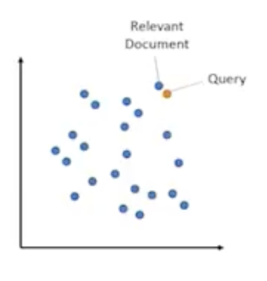
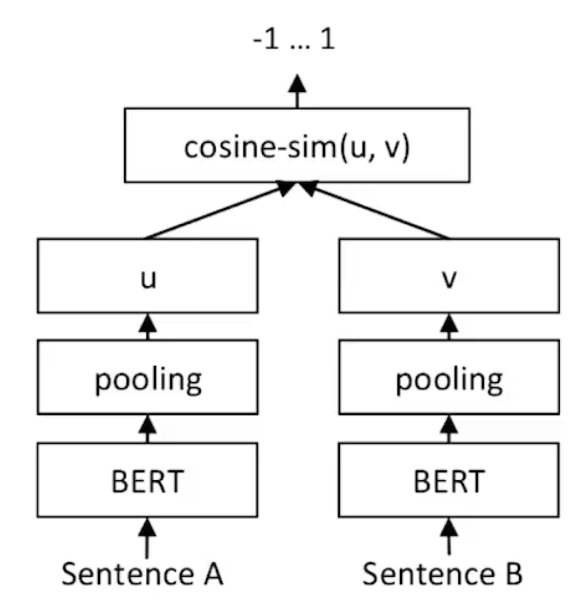
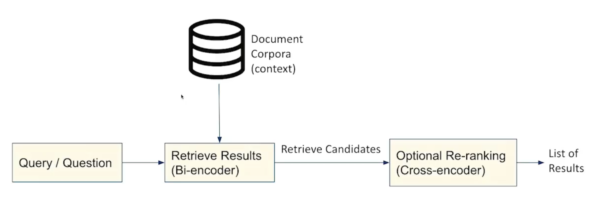

# Semantic Search 

Retreiving relevant documents from a natural language query i.e we will have a vector space full of embeddings, and each embedding(dot) representing a document. Then we can take a query and embed it in such a way that we could compare it to the other vectors and retreive relevant documents as it is stated in the natural query.

Unlike traditional search engines, semantic search algorithms use contextual look-ups, providing closer contextual matches than traditional lexical matches

| **Parameter** | **Traditional Search** | **Semantic Search** |
| ***How it works*** | Matches exact keywords/phrases from a query to those in the document/database | Uses Natural Language Processing (NLP) and Machine Learning (ML) to understand intent and context of query |
| ***Example*** | Searching for `car repair shop` returns documents with those exact words | Searching for `where can i get my car fixed?` might return results for `car repair shop`, `auto garage`, or `mechanics near me` |
| ***Limitations*** | Misses synonyms, context, and varied phrasing | May require more compute and occasionally returns tangential matches |
| ***Key Tech*** | Inverted index, TF-IDF, Boolean Logic | Word embeddings(Word2Vec, GloVe), transformers(BERT,GPT) |
| ***Benefits*** | Fast, Simple, Easy to implement | More relevant results, understands natural language and supports complex queries |

--- 

## Type of Semantic Searches

| **Parameter** | **Symmetric Semantic Search** | **Asymmetric Semantic Search** |
| ***Definition*** | Compares two pieces of text that are semantically similar in structure and intent | Compares two pieces of text with different roles, like a question and a potential answer |
| ***Typical Use Case*** | Duplicate detection, clustering, paraphrase identification | Question answering, retrieval-based search, FAQ matching |
| ***Query vs. Document Structure*** | Query and document are usually of similar length and structure | Query is often short (e.g., question); document is longer and informative |
| ***Model Training Focus*** | Trained to produce embeddings where similar inputs are close in vector space | Trained to align questions with relevant answer-like text, handling semantic gaps |
| ***Embedding Similarity Use*** | Direct cosine similarity or dot product between embeddings | May use cross-encoders or dense retrieval with ranking models for better alignment |
| ***Example*** | Retrieving news article titles given a query | Retreiving an entire paragraph from a textbook to answer a question |
| ***Examples of Models*** | Sentence-BERT, Universal Sentence Encoder | ColBERT, DPR (Dense Passage Retrieval), Cross-encoders (e.g., BERT for QA) |
| ***Strengths*** | Fast, scalable, good for clustering and deduplication | High precision in retrieval, especially for diverse question formats |
| ***Weaknesses*** | May not perform well on complex question-answer relationships | Typically slower and more resource-intensive |

---

# Siamese Architecture

A **Siamese bi-encoder** architecture enables learning of sentence embeddings that can be directly compared using **cosine similarity**.

In the illustration above, the data flow is as follows:

1. **Input**: Two sentences, A and B, are fed into **identical neural networks**, typically based on a shared BERT (Bidirectional Encoder Representations from Transformers) model.
2. **Encoding**: Each sentence is independently processed by BERT to produce its own contextualized representation.
3. **Pooling**: The BERT outputs are pooled (e.g., using CLS token or mean pooling) to obtain fixed-size vector embeddings, denoted as **u** and **v** for sentences A and B respectively.
4. **Comparison**: The resulting embeddings **u** and **v** can then be compared using **cosine similarity**, which measures their directional similarity in the embedding space.

> **Cosine Similarity** returns a value in the range **\[-1, 1]**:
>
> * **+1** indicates identical direction (high similarity)
> * **0** indicates orthogonality (no similarity)
> * **-1** indicates opposite direction (high dissimilarity)

---

## Bi-Encoder vs Cross-Encoder BERT Architecture

| **Parameter** | **Cross-encoder BERT** | **Bi-encoder BERT** |
| **Input Processing** | Both the query and document are **concatenated** into one input and passed to BERT. | The query and document are **encoded separately**, each passed through BERT independently. |
| **Token Interaction** | BERT uses self-attention **across all tokens**, so the model learns fine-grained interactions between query and doc. | Since query and doc are encoded separately, **no direct interaction between their tokens** happens. |
| **Inference Speed** | **Slow**, because the model must process the entire pair (query + document) every time. | **Fast**, because you can **precompute document embeddings** and reuse them for many queries. |
| **Scalability** | Not suitable for large datasets or real-time systems — recomputing is expensive. | Highly scalable for large corpora — use **vector search** or **ANN** to retrieve results quickly. |
| **Accuracy** | Very accurate for pairwise tasks (e.g., "Does this query match this document?"). | Typically **less accurate**, especially for nuanced tasks — no token-to-token comparison. |
| **Use Cases** | Best for **reranking** a small set of candidates (e.g., top 100 docs). Also used in NLI, QA, sentence classification. | Best for **first-stage retrieval** or **semantic similarity** where speed matters. |
| **Model Invocation** | One BERT model processes both query and doc **together**. | Each input is processed separately — can use **two identical or shared BERTs**. |
| **Similarity Computation** | The model gives a **score or class** directly (e.g., relevance or entailment). | Use a similarity metric (e.g., **dot product or cosine similarity**) between two vectors. |
| **Example Application** | Search engine reranking, answer selection, duplicate detection. | Embedding-based search, semantic search, chatbot candidate retrieval. |

--- 

### Using Bi-Encoder and Cross-Encoder BERT together:

This is the workfow for Asymmetric Semantic Search where:
    - A query or a Question is taken in
    - Bi-enocder is used to retreive results from a large corpora of documents
    - The candidates are chosen and passed to next block: Cross encoder
    - Cross-Encoder BERT or BERT is then used to rank those candidates/results in the order or relevance

---

## Code

[Implementation of Siamese BERT-networks for semantic searching in Python](codes/bert/siamese_bert_semantic_search.ipynb)