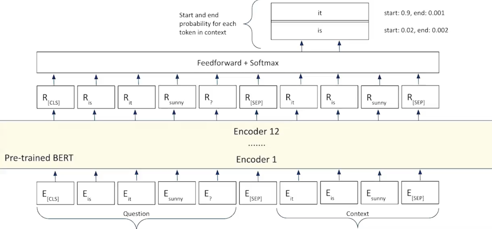

# Fine-tuning BERT for sequence classification

BERT uses Extractive Answering process in which answer to the question asked is direct substring in the context.

***Example***

- **Question:** What is Matt like?
- **Context:** Matt is a great guy who will always be there for you whenever you need.

***For Extractive Answering:*** "The kind guy who will alwats be there for you whenever you need" - Used by BERT and its flovors

***For Abstractive Answering:*** "A kind guy" - Used by GPT and T5

## Steps to be followed:

- Take in 2 sequences
    - Sequence A: A question
    - Sequence B: Context which is a chunk of text with answer to the question in it
- Pass these seuences to the pre-trained BERT and get a tokenized output.
- Add a FeedForward layer on top of each token like in Token Classification.
- Predict wheather each token represents the start or the end of the answer to the question.

## Code

[Implementation of Question Asnwering for BERT in Python](codes/bert/bert_for_qa.ipynb)