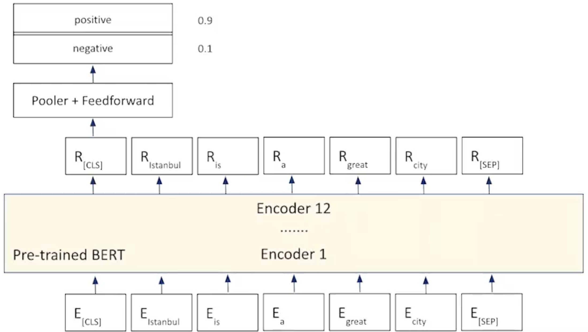

# Fine-tuning BERT for sequence classification

## Steps to be followed:

- Take in 2 sequences
    - Sequence A: A question
    - Sequence B: Context which is a chunk of text with answer to the question in it
- Pass these seuences to the pre-trained BERT and get a tokenized output.
- Add a FeedForward layer on top of each token like in Token Classification.
- Predict wheather each token represents the start or the end of the answer to the question.

## Code

[Implementation of Question Asnwering for BERT in Python](codes/bert_for_qa.ipynb)