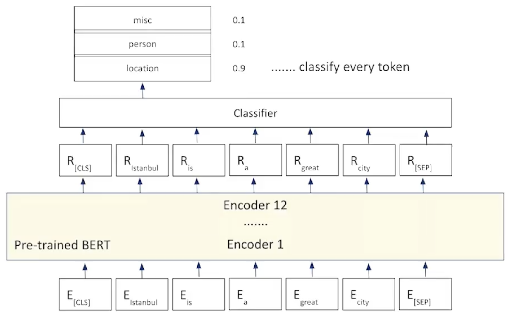

# Fine-tuning BERT for Token Classification

## Steps to be followed:

- Take a pre-trained BERT.
- Feed a single sequence to the pre-trained model.
- The output of sequece when passed through pre-trained BERT will be a tokenzied sequence.
- All the tokens are passed through the FeedForwad layer to categorize them to categories.
- ***Example:** In the Named Entity Recognition (NER) we use the token classification to classify the tokens into sub categores like names, places, objects etc.

## Code:

[Implementation of Token Classification for BERT in Python](codes/bert_token_classification.ipynb)