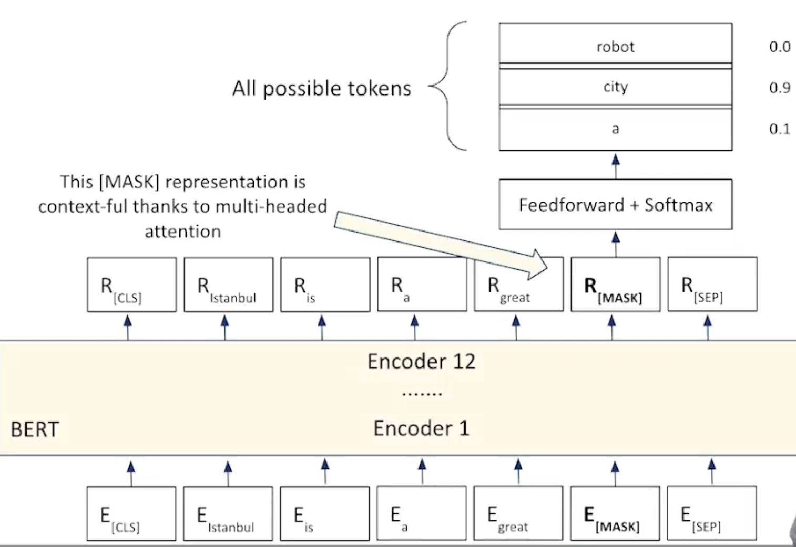
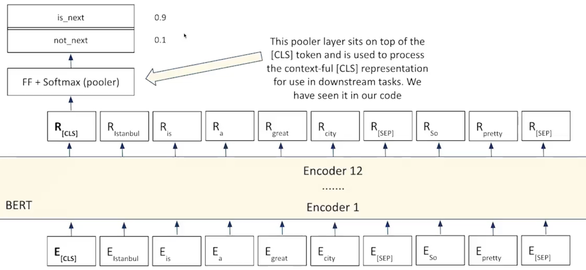

# Pretraining BERT

Pre-Training is where BERT starts to stand out and it is pre-trained on 2 tasks:

- The Masked Language Model (MLM)
    - Replace 15% of words in corpus with a special [MASK] token and BERT is asked to fill it
    - ***Example:*** "Isnanbul is a great [MASK] to visit."
    - Like [CLS] and [SEP], [MASK] is one of the special tokens that BERT recognizes
    - ***Process:***
        - Input a sequence.
        - It is converted to contextless tokens including [MASK].
        - This contextless tokenized sequence is then fed to encoder stack.
        - Encoder stack converts the contextless tokens to contextful tokens.
        - For MLM, on top of contextful representation, a FeedForward layer is added
        - FeedForward layer performs classification on all possible words in the vocabulary
        - 

- Next Sentence Prediction (NSP)
    - A Classification problem 
    - Given 2 sentences A and B, does sentence B come directly after sentence A?
        - True or False / 1 or 0
    - ***Example:***
        - **A:** "Istanbul is a great city to visit."
        - **B:** "I was just there."
        - Did sentence B come directly after sentence A? Yes or No
    - ***Process:***
        - Input a sequence.
        - It is converted to contextless tokens.
        - This contextless tokenized sequence is then fed to encoder stack. Now this is also giveing teh segment ids as we input 2 sequences
        - Encoder stack converts the contextless tokens to contextful tokens.
        - For NSP, we add a pooler on top of the [CLS] token as after passing through BERT, [CLS] token is contextful and has attention due to scaled dot product attention.
        - So now the [CLS] token is passed through a FeedForward and Softmax layer (Pooler Layer) for which there are 2 output options:
            - is_next
            - not_next
        - 

These 2 tasks help BERT learn how words/language works in general.

---

# Fine-Tuning BERT for NLP tasks

Once BERT has a general idea of about how words used in sentences (MLM) and how sentences are treated in larger documents (NSP), we get a pretainied language model BERT.

After we get a pretained BERT model, we can further train it for specifc tasks. This is called Fine-Tuning.

3 tasks that we can use Fine-Tuning for:
- **Sequence classification:**
    - Take a pre-trained BERT.
    - Feed a single sequence to the pre-trained model.
    - The output of sequece when passed through pre-trained BERT will be a tokenzied sequence.
    - Just consider the representation of the [CLS] token as it contains the overall context for the entire sequence in the NSP task using the pooler attribute.
    - Add another FeedForward layer after the pooler to map it to any n number of  classes the user wants.
    - **Example:**
        - ***Sequence -*** "Istanbul is a great city"
        - ***Sequence classes -*** Positive / Negative

- **Token classification:**
    - Take a pre-trained BERT.
    - Feed a single sequence to the pre-trained model.
    - The output of sequece when passed through pre-trained BERT will be a tokenzied sequence.
    - All the tokens are passed through the FeedForwad layer to categorize them to categories.
    - ***Example:** In the Named Entity Recognition (NER) we use the token classification to classify the tokens into sub categores like names, places, objects etc.

- **Question/Answering:**