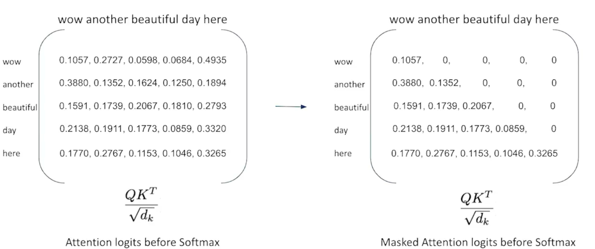

# GPT

GPTs (Generative Pre-trained Transformers) 

- Auto-regressive language models i.e it predicts tokens based on the past contexts.
- Decoders are trained on huge corpora of data
- Decoders are used from the transformers architecture

---

## GPT models

- ***GPT-1*** .117B parameters
- ***GPT-2*** 1.5B parameters
    - **GPT-2 Small** 117M parameters
    - **GPT-2 Medium** 345M parameters
    - **GPT-2 Large** 762M parameters
    - **GPT-2 Extra Lagre** 1542M parameters
- ***GPT-3*** 175B parameters

---

## How GPT works?

GPT and BERT are similar in the sense that they both use [Scaled Dot Product Attention](how_transformers_use_attention.md) to infuse context into the tokens.

For GPT we work explicitly for decoders instead of encoders which was the case for BERT

---

## GPT Tokenization

GPT has Byte-level tokenization as compared to BERT's wordpiece tokenization:

***Sample Sequence:*** I am Niket Girdhar

***Tokenized Sequence:*** ["I","am","Niket""Girdhar","<|endoftext|>"] `This is just a sample and not the actual tokenization.`

`<|endoftext|>` is a special token that is used to indicate the end of sentence.

The tokenization happens by splitting the list of tokens into the vocabulary of over 50,000 words and adding `<|endoftext|>` token in end.

GPT's tokenizatuon also uses the simialar format to BERT for dealing with unknown tokens i.e. break them into smaller chunks.

---

## Embeddings in GPT

GPT has 2 seperate embeddings to tokenize sequences:

- **Word Token Embeddings (WTE):**
    - Represents context-free meaning of each token.
    - A look-up of over 50,000 possible vectors.
    - ***Learnable*** during training process.

- **Word Position Embeddings (WPE):**
    - Used to represent the position of tokens in the sequence.
    - ***Non-Learnable*** during training process.

NOTE: The difference between BERT and GPT is that BERT had an additional layer of embeddings called segment embeddings for Segment A and Segment B differenciation. GPT has no concept of sentences as it can go however long it can before it reaches the end token.

---

## Masked Multi-Head Attention

In BERT the in attention matrix a token was able to access the attention scores of all the previous or upcoming tokens.

In GPT, before softmax the top triangle matrix portion is reduced to zero so as teh tokens may not know what other tokens will be ahead.

i.e. In BERT we are able to access both past and future context but in this maked self-attention mechanism, GPT is explicitly disallowed from looking at the context of later words during training..

This is done so that GPT doesn't have the access to future tokens so as it can generate text just based on the past conetxt tokens.

In GPT, the token is just able to access attention for tokens just before it and this is very important because when it is actually predicting language in real time (inference time), the token predictions happen one at a time unlike in BERT where it is able to take context at once. This iterative nature slows down GPT while generation.

---

Sure! Here’s the completion of the list of parameters typically used during inference time:

---

- **`temperature # float value`**  
    - **Range**: 0-1.  
    - **Low temperature** → Less random | More confident.  
    - **High temperature** → More randomized output.  
    - Can be considered as the creativity value for the model.

- **`top_k # int value`**  
    - While predicting, looks at the top `k` responses based on their confidence scores.  
    - Set it to `0` to deactivate this parameter, meaning the model will consider all possible responses.

- **`top_p # float value`**  
    - While predicting, only considers tokens with more than `x%` (where `x` is the value set here) of the confidence score.  
    - Setting it to `0` deactivates this parameter, meaning no limit on token selection by cumulative probability.

- **`beams # int value`**  
    - Refers to beam search, which explores multiple hypotheses for possible output sequences.  
    - A higher value increases the number of potential sequences the model explores, leading to potentially more accurate but slower generation.  
    - It is often used for generating more focused, deterministic responses.  
    - Typically, a larger number of beams increases the likelihood of finding the optimal solution.

- **`do_sample # bool value`**  
    - **`True`**: Allows the model to sample from the probability distribution of the next word/token (i.e., the output is more random).  
    - **`False`**: The model will always pick the token with the highest probability, which can result in more repetitive or deterministic outputs.

- **`repetition_penalty # float value`**  
    - A value greater than 1.0 penalizes repetitive sequences, encouraging the model to produce more diverse text.  
    - A value of 1.0 means no penalty (standard behavior).

- **`length_penalty # float value`**  
    - Affects the model's preference for generating shorter or longer responses.  
    - A value of 1.0 means no preference, while values greater than 1.0 penalize longer sequences, and values less than 1.0 encourage longer sequences.

- **`stop_sequence # string or list of strings`**  
    - Defines one or more sequences where the model should stop generating text.  
    - Once the model outputs this sequence, it will halt the generation process.

- **`presence_penalty # float value`**  
    - This penalty adjusts the likelihood of the model introducing new words.  
    - A value greater than 0.0 increases the penalty for already existing words, encouraging the model to generate more varied responses.

- **`num_return_sequences # int value`**  
    - Defines the number of alternative sequences the model should generate for each prompt.  
    - Useful for getting multiple variations of a response, typically used in cases where creativity or diversity is desired.

---
## Code

[Experimenting with GPT architecture in python](codes/gpt/gpt.ipynb)