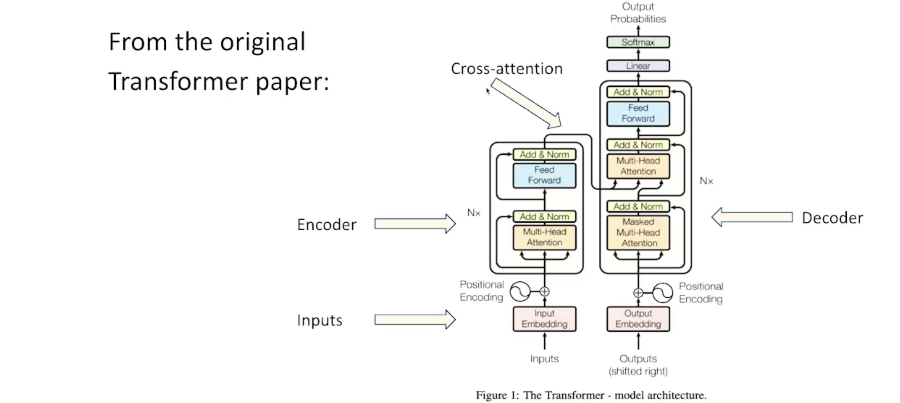
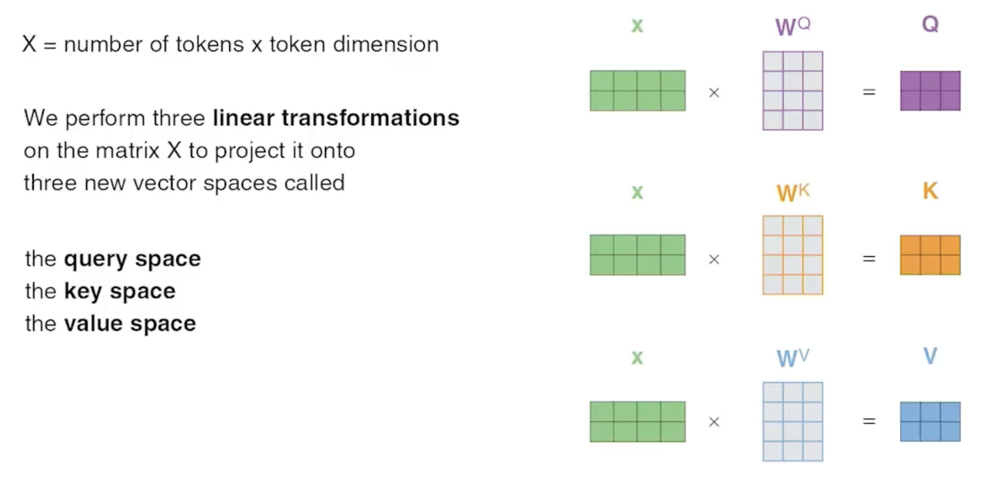
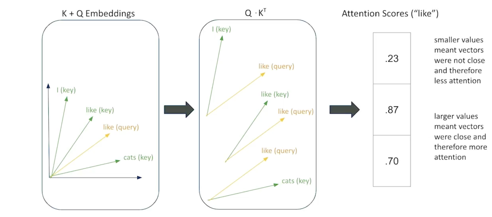
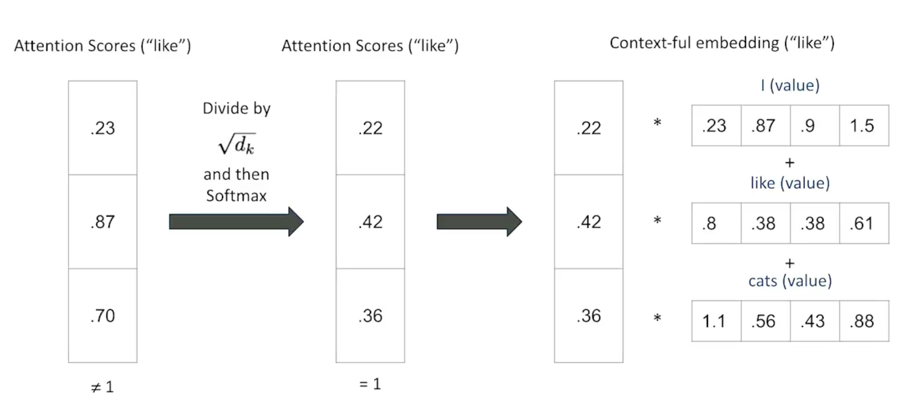
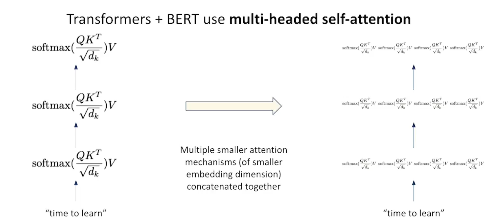

# Transformers

## Architecture of Transformer

---

## **Cross-Attention in Transformers**
### **Definition**
Cross-attention is a variation of the attention mechanism where elements from one sequence attend to elements from a different sequence.

### **Purpose**
Cross-attention allows a model to focus on a source sequence while generating a target sequence, improving contextual alignment.

### **Example: Machine Translation**
- In **machine translation**, cross-attention helps relate words in the source language (e.g., "cat") to corresponding words in the target language (e.g., "gato" in Spanish).

---

## **Self-Attention vs. Cross-Attention in Transformers**
Transformers utilize both **self-attention** and **cross-attention** at different stages of processing:

### **1. Self-Attention**
- **Where?** Encoder and decoder layers.
- **Function:** Each token attends to every other token in the same sequence.
- **Purpose:** Captures context and dependencies within a sequence.
- **Example:** In an input sentence, self-attention ensures that words like "bank" in *"I went to the bank"* consider surrounding context.

### **2. Cross-Attention**
- **Where?** Decoder layers.
- **Function:** The decoder attends to the encoder’s output representations.
- **Purpose:** Aligns the source sequence (encoder output) with the target sequence (decoder generation).
- **Example:** In translation, the decoder aligns "gato" with "cat" while generating the target sentence.

## **Summary**
| Attention Type   | Used In  | Purpose |
|-----------------|---------|---------|
| **Self-Attention** | Encoder & Decoder | Captures internal sequence context |
| **Cross-Attention** | Decoder | Aligns encoder’s output with generated target |

Transformers rely on both self-attention (to understand internal sequence relationships) and cross-attention (to relate different sequences).

---

## **Scaled Dot Product Attention**

### **Scaled Dot-Product Attention in Transformers**

**Definition**:  
Scaled Dot-Product Attention is a fundamental mechanism in Transformers that allows a model to focus on relevant parts of an input sequence when processing each token. It is used in both **self-attention** and **cross-attention** layers.

### **Formula**

Lets take $X$ as the tokenized input.  
And from that, we compute 3 matrices: Query, Key, and Value, which is done as:  

The attention function is computed as:

$$
\text{Attention}(Q, K, V) = \text{softmax} \left(\frac{QK^T}{\sqrt{d_k}}\right) V
$$

Where:
- $Q$ is the Query matrix
- $K$ is the Key matrix
- $V$ is the Value matrix
- $d_k$ is the dimensionality of the Key vectors

Where:
- **$Q$ (Query)**: The current token’s representation.
- **$K$ (Key)**: All tokens in the sequence (same as $Q$ in self-attention, different in cross-attention).
- **$V$ (Value)**: The representations used to generate output.
- **$d_k$**: The dimensionality of the key vectors (used for scaling).
- **Softmax**: Ensures attention weights sum to 1.

### **Intuitive Meaning of Matrices**  

1. **$Q$ (Query) – "What am I looking for?"**  
   - Represents the **current token’s request** for relevant information.  
   - **Analogy:** A student asking a question in class.  
   - **Example:** If the word "cat" is processing itself, its Query vector helps determine what information it needs from other words.  

2. **$K$ (Key) – "What do I have to offer?"**  
   - Represents the **content** of each token, which other tokens may query.  
   - **Analogy:** A library’s catalog system—each book (token) has a description (key), and queries search through these descriptions.  
   - **Example:** If the Query asks about “cat,” the Key of “animal” might indicate relevance.  

3. **$V$ (Value) – "What information should I return?"**  
   - Stores the **actual information** that will be retrieved based on attention scores.  
   - **Analogy:** The actual book in a library that matches a search query.  
   - **Example:** If the Query is about “cat” and the Key suggests relevance, the Value might contain details like “a small domesticated carnivorous mammal.”  

4. **$\text{softmax}(QK^T)$ – "How relevant is this?"**  
   - Determines **how much focus** each token should give to others.  
   - **Analogy:** A search engine ranking results by relevance.  
   - **Example:** If “cat” queries “animal” and “car,” softmax ensures that “animal” gets a higher relevance score.  

### **Summary Table**  

| Matrix  | Intuitive Meaning | Analogy |
|---------|------------------|---------|
| **$Q$ (Query)** | What am I looking for? | A student's question |
| **$K$ (Key)**   | What do I have to offer? | A library catalog entry |
| **$V$ (Value)** | What information should I return? | The actual book in the library |
| **Softmax($QK^T$)** | How relevant is this? | Search engine ranking |

### **Why Scaling?**
- Without **$\sqrt{d_k}$**, large values in $QK^T$ could push softmax into extremely small gradients, making optimization difficult.
- Scaling **stabilizes gradients** and helps in better learning.

### **Steps in Scaled Dot-Product Attention**

1. **Compute similarity scores** between **queries ($Q$)** and **keys ($K$)** via matrix multiplication $QK^T$.
   - - ***The resulting matrix $QK^T$  is a square matrix of dimensions (tokens × tokens), representing attention scores between tokens.***  
   - 

2. **Scale the scores** by dividing by $\sqrt{d_k}$ to prevent large values from dominating the softmax function.  

3. **Apply softmax** to normalize scores into attention weights, ensuring they sum to 1.  

4. **Multiply the attention weights** with the **values ($V$)** to compute the final attention output.
   - - ***This step transforms the V matrix from containing contextless information to context-aware information by weighting each token’s contribution based on attention scores.***     

### **Example**
If we have three words:  
**"The cat jumps"**, and we want to compute self-attention on "cat":

- **Query**: Representation of "cat".
- **Key**: Representations of "The", "cat", and "jumps".
- **Value**: Same as key vectors in self-attention.
- The model assigns higher attention to **related words**.

### **Usage in Transformers**
- **Self-Attention**: Each word attends to all other words in the sequence.
- **Cross-Attention**: Decoder attends to encoder outputs.

This mechanism enables Transformers to capture **context-dependent** relationships efficiently.

---

## Multi-Headed Attention

Multi-Head Attention is a key mechanism used in transformer models, like those behind BERT and GPT, to improve the ability of a model to process information in parallel and capture various relationships within the data.

### How it Works:
- **Parallel Attention:** Instead of having a single attention mechanism, Multi-Head Attention runs multiple attention mechanisms (heads) in parallel. Each head learns to focus on different parts of the input sequence, capturing different relationships or patterns.
  
- **Learned Representations:** Each attention head works on a different linear projection of the input data. The final output is a concatenation of the results from each head, which is then linearly transformed into the final output.

### Why it's Useful:
- **Capturing Diverse Features:** Each attention head is able to focus on different aspects of the input, such as different words, sentences, or relationships. This helps in understanding complex contexts and nuanced patterns.
- **Resource Efficiency:** The model can capture these different relationships simultaneously without needing multiple passes through the data, making it computationally efficient.

So Multi-Head Attention improves the model's ability to handle complex input relationships by capturing various features at once, providing richer and more detailed representations.