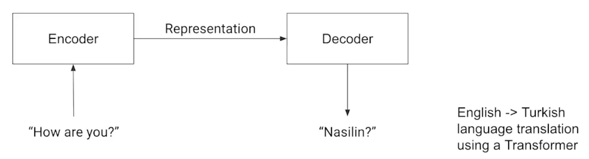
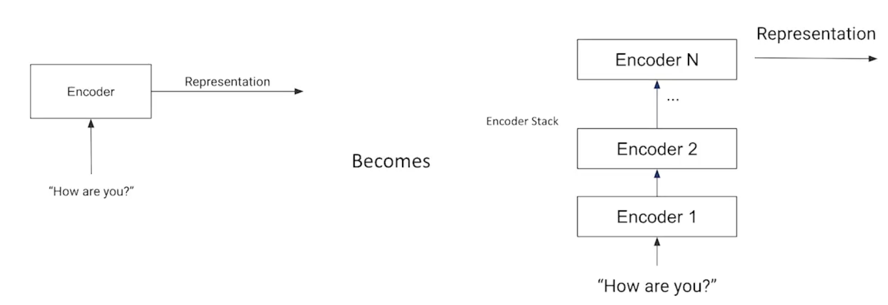
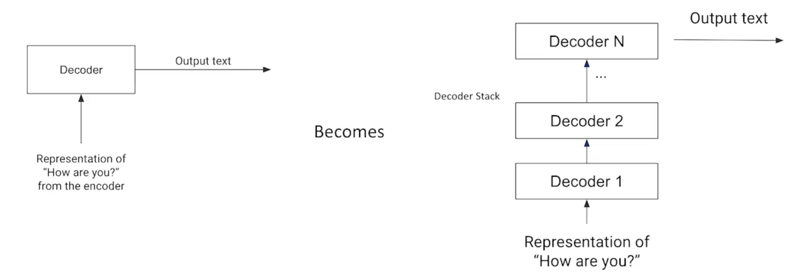

# Attention and Language Models

## Introduction to NLP
Natural Language Processing (NLP) is a field within Artificial Intelligence (AI) focused on enabling computers to interpret, understand, and interact with human language in a way that is both meaningful and useful.

NLP combines:
- ***Computational Linguistics:*** which involves designing rule-based models for parsing and understanding human language.
- ***Machine Learning (ML):*** which allows systems to improve over time by learning patterns from large datasets of human language.

Computer tends to understand the text by converting the to a vector of numbers called embeddings

---

## Word embeddings

Word embeddings are a way of representing words as vectors in a high-dimensional space. These vectors are learned from large text corpora, and words that have similar meanings are positioned near each other in the vector space.

- ***Example:*** The words "king" and "queen" would be closer to each other than "king" and "dog" in the embedding space.
- ***Why is it important?*** Embeddings preserve the semantic relationships between words, allowing algorithms to perform tasks like analogies (e.g., "man" is to "woman" as "king" is to "queen") and clustering (e.g., grouping similar words together).

The main challenge with word embeddings is that they are influenced by the biases in the training data.
***The algorithm used to learn text embeddings: Word2Vec, GloVe etc.***

---

## Bias in large text corpora

Bias in NLP systems can emerge both directly and indirectly, and it is critical to understand these forms of bias as they can lead to unfair, stereotypical, or harmful outcomes.

- ***Direct Bias:*** Say terms like sports are inherently closer to male words where murse / air hostess is closer to female words
- ***Indirect Bias:*** More nuanced correlations in the learned embeddings leading to teacher being closer to volleyball than football, due to their larger female associations.

---

## Attention:
- **Definition**: Relates elements from one sequence to another.
- **Purpose**: Helps focus on important parts of the input sequence while processing each token.
- **Example**: In machine translation, when translating a word, the model might focus on other relevant words in the sequence for better context.

## Self-Attention:
- **Definition**: Relates each token in a sequence to every other token in the same sequence.
- **Purpose**: Each word gets context by attending to other words in the sentence, capturing dependencies regardless of distance.
- **Example**: In "The cat sat on the mat," the word "cat" attends to words like "sat" and "mat" for better understanding.
  
## Why Self-Attention is Important:
1. **Captures long-range dependencies**: Allows the model to understand distant relationships between words.
2. **Parallelizable**: Unlike RNNs, it processes the entire sequence at once, speeding up training.
3. **Context-sensitive representations**: Each word embedding is dynamically weighted by other words in the sequence.

---

## Encoder - Decoder Architecture

Transformers are built on the self-attention-based encoder-decoder architecture, which is designed to handle sequence-to-sequence tasks efficiently.

### **Encoder:**
- The encoder takes the input sequence and converts it into a matrix representation.
- It processes the entire sequence in parallel rather than one step at a time, using self-attention mechanisms to capture relationships between words regardless of their position in the sequence.
- The output is a rich, context-aware representation of the input sequence.
  

### **Decoder:**
- The decoder processes the matrix representation generated by the encoder and iteratively generates the output sequence.
- Similar to the encoder, it uses self-attention to model the context of the sequence but also attends to the encoder’s output through cross-attention mechanisms.
- This iterative generation is performed step by step, making predictions at each step based on the previously generated output and encoder's representation.

Note that both the input to the encoder and the output of the decoder are of **variable length**, making the transformer architecture flexible and adaptable to different kinds of sequence generation tasks.

---

## Language Models

In language modeling tasks, the goal is to train a model to predict the next word or fill in missing words in a sequence, helping it learn the structure of the language. There are two primary types of language models:

### ***1. Auto-regressive:***
- Auto-regressive models generate text by predicting one word at a time, conditioned on the previously generated words - like auto complete. 
- Natural Language Generation (NLG).
- This model builds the output sequence step-by-step, using its past predictions as context for future ones.
- Examples: GPT Family

### ***2. Auto-encoding:***
- Auto-encoding models learn to reconstruct the original input sequence by predicting the missing parts of the sequence, often in a masked language modeling fashion.
- Natural Language Understanding (NLU).
- These models encode the entire sequence at once and then decode it, using self-attention to process the input and predict the missing information.
- Examples: BERT

Each of these approaches has different strengths and is suited to different kinds of language tasks, such as text generation or text understanding.