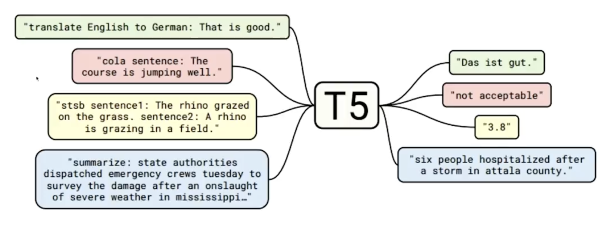
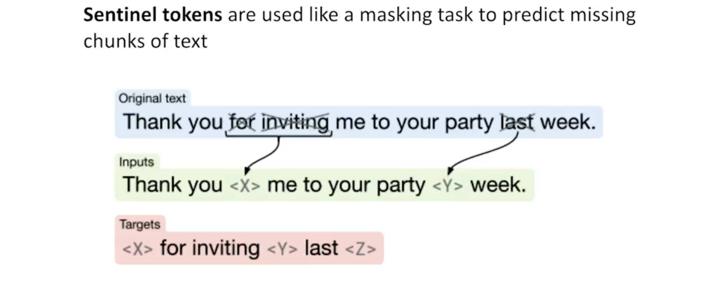

# T5 Architecture

Text To Text Transfer Transformer or T5 for short is based on Encoder-Decoder Architecture whereas the previous models are just Encoder or just Decoder based:

| **Parameter** | **Encoder-based** | **Decoder-based** |
| ***Example*** | BERT | GPT |
| ***Advantage*** | Faster and more efficient for Natural Language Understanding (NLU) tasks | Flexible for text generation and multitask learning via prompt engineering |
| ***Disadvantages*** | Less effective for text generation and not suitable for autoregressive tasks | Typically slower for inference in NLU tasks and may require more compute |
| ***Use-cases*** | Text classification, token classification, sentence similarity, question answering | Text generation, summarization, translation, conversational agents |

So T5 is an implementation of entire transformer architecture: both ***Encoder stack*** and ***Decoder Stack*** 

T5 directly comes pre-trained on various tasks:

* **Translation**: Converts text from one language to another (e.g., English to German).
* **CoLA** ***(Corpus of Linguistic Acceptability)***: Determines if a sentence is grammatically acceptable.
* **STSB** ***(Semantic Textual Similarity Benchmark)***: Measures how similar two sentences are in meaning.
* **Summarization**: Condenses a longer piece of text into a brief summary.

---

The following shows T5 using something called ***Sentinal Tokens*** where similar to BERT it tries to predict the masked values/text but unline BERT T5 doesn't mask just one token at a time. It can mask multiple tokens and can predict them.

---

## Training objectives of T5

- ***BERT-style objective***: Masking tokens and predicting the original text, Classification tasks
- ***Auto-regressive/Causal/GPT2 stype objective***: Predicting the next word
- ***Deshuffling***: Shuffling the input tokens randomly and predicting the original text

---

## Cross-Attention

* **In BERT**, the model relies on **Multi-Head Attention** to learn complex patterns and grammatical rules across a sentence by attending to all positions simultaneously. [Click to read more about it](how_transformers_use_attention.md#Multi-Headed-Attention)

* **In GPT**, it uses **Masked Multi-Head Attention**, which is structurally similar to BERT’s attention but with a key difference: it applies a **mask** to prevent the model from seeing future tokens. This enforces an **auto-regressive** property, ensuring that predictions for position *t* only depend on positions ≤ *t*—a necessity for generative tasks like text completion.

* **Cross-Attention** occurs in **encoder-decoder architectures** (like T5 or original Transformer for translation). Here, the **decoder attends to the encoder's outputs**, allowing it to incorporate source sentence information when generating each target token.