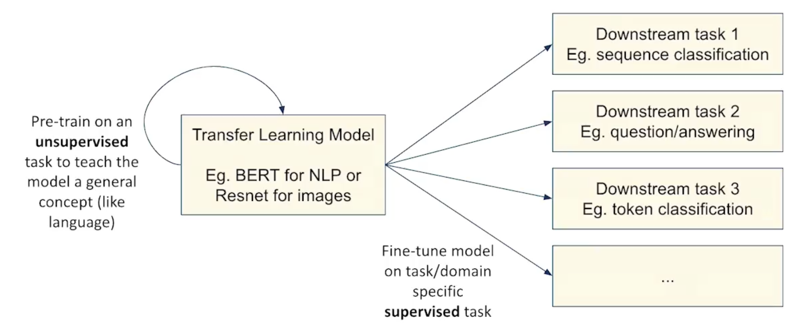
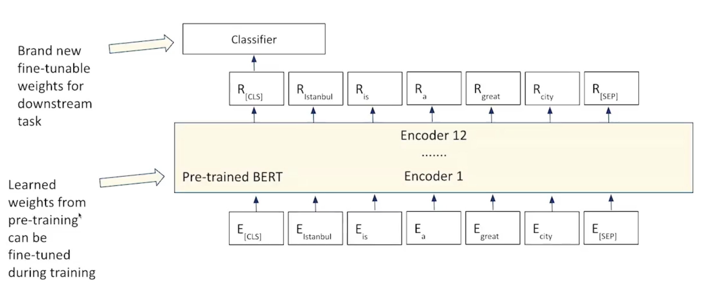

# Transfer Learning
Transfer learning involves taking a model that has already been trained on a large dataset for a particular task and reusing it for a new but related task. Instead of training a model from scratch, which can be computationally expensive and time-consuming, you can leverage knowledge learned from the first task to boost performance on a second task.

### Key Concepts:
1. **Source Task (Pre-trained Model)**: The model is initially trained on a large dataset for a general task (e.g., image classification on ImageNet, language modeling, etc.). This pre-trained model has already learned useful features or representations from the source task.

2. **Target Task**: This is the new task on which you want to use the pre-trained model. The target task often has less data, and the goal is to adapt the model to perform well on this task, leveraging the knowledge gained from the source task.

### **Steps Involved in Transfer Learning:**

1. **Select a Source Model**:
   - Choose a pre-trained model that has been trained on a similar or general task.
   - Common source models include ResNet, VGG, BERT, GPT, etc.
   - The source model should have learned useful feature representations that can be helpful for the target task.

2. **Reuse the Pre-trained Model**:
   - **Feature Extraction**: You can freeze most of the layers of the pre-trained model and only train the final layers. This is typically used when the target task is quite similar to the source task.
   - **Fine-tuning**: You can unfreeze the pre-trained layers and train the entire model on the target task. This approach adjusts the weights of the pre-trained model to be more suitable for the target task.

3. **Train the Model on the Target Task**:
   - **Re-training**: If necessary, retrain the model by exposing it to the data from the second task. You may choose to train only the later layers or the entire model, depending on the similarity of the tasks.
   - **Transfer Knowledge**: The pre-trained layers of the model should help improve generalization on the target task, especially when the target task has limited labeled data.

- 

### Example:
- **Image Classification**:
  - You might start with a pre-trained model like ResNet, which was trained on ImageNet. You can use this model as a feature extractor for a new task, such as classifying medical images. You might fine-tune only the last few layers of the model to adapt it to the specifics of medical imaging.
  
- **Natural Language Processing**:
  - You might use a pre-trained model like BERT, which was trained on vast amounts of text. You can fine-tune this model for tasks like sentiment analysis, question answering, or named entity recognition (NER) with smaller task-specific datasets.

### Benefits of Transfer Learning:
- **Reduced Training Time**: By starting with a pre-trained model, training time can be drastically reduced.
- **Improved Performance**: Transfer learning often leads to better performance, especially when the target task has limited data.
- **Efficient Use of Resources**: You can use high-performance models trained on massive datasets without the computational burden of training from scratch.

---

## Fine-Tuning Approaches

Fine-tuning is a process in machine learning where a pre-trained model is adapted to a specific task using a smaller, task-specific dataset. There are several approaches to fine-tuning, depending on the needs of the project and the computational resources available.

- 

Here are the three approaches you've mentioned:

1. **Update the Whole Model on Labelled Data + Add Additional Layers on Top**
   - In this approach, you update all the weights of the model (e.g., by using gradient descent) based on the labeled dataset, meaning that the entire network is retrained. Additional layers (e.g., fully connected layers for classification) are added on top of the existing model. This method can improve model performance if you have enough labeled data and computational power but can be time-consuming.

2. **Freeze a Subset of the Model**
   - Here, only a portion of the model is trained, while the rest of the layers are "frozen" (i.e., their weights are not updated during training). Typically, the lower layers (which learn more generic features like edges, textures, etc.) are frozen, while the upper layers are fine-tuned. This approach is useful when you want to avoid overfitting with a small dataset and leverage the pre-trained knowledge from the lower layers.

3. **Freeze the Whole Model and Only Train the Additional Layers Added on Top**
   - In this case, the entire pre-trained model is frozen, and only the new layers added on top (e.g., fully connected layers for classification) are trained. This is useful when you have very limited labeled data and want to avoid any risk of overfitting by only adjusting the new layers. It is an efficient approach when working with small datasets.

Each approach has its benefits and is suited for different scenarios. For example:
- The first approach might be chosen when you have a large amount of task-specific labeled data and want to fully adapt the model to your problem.
- The second approach is helpful when you want to fine-tune on a smaller dataset and save computational resources.
- The third approach is best when you have limited labeled data and want to retain the general knowledge learned by the pre-trained model.