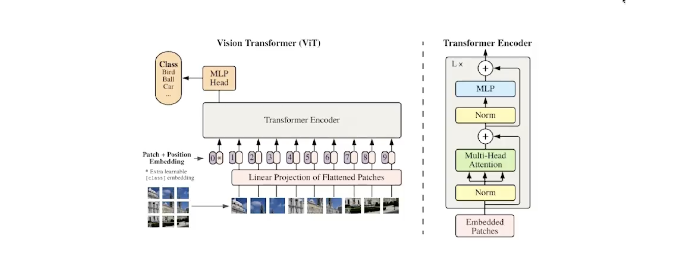

# Vision Transformers (ViT)

Vision Transformers (ViT) were first introduced by the Google Research team as a novel approach to bring the success of Transformer models—originally designed for Natural Language Processing (NLP)—into the domain of Computer Vision

### Key Concepts:

* **Inspired by BERT:**
  ViTs are conceptually similar to BERT models used in NLP. They rely on self-attention mechanisms to model relationships between parts of the input

* **Image as a Sequence:**
  Instead of word tokens, ViTs operate on **image patches**. An input image is divided into fixed-size non-overlapping patches (e.g., 16x16 pixels each), and each patch is treated like a "token"

* **Linear Embedding:**
  Each patch is flattened and passed through a linear layer to obtain a vector embedding, analogous to word embeddings in text models

* **Positional Encoding:**
  Since Transformers lack inherent knowledge of the spatial structure, **positional embeddings** are added to retain information about the position of each patch in the original image

* **Transformer Encoder:**
  The sequence of embedded patches with positional information is passed through multiple Transformer encoder layers to learn rich visual representations

* **Special Token at the start:**
  Similar to [CLS] token in BERT, ViT has a class token that is not related to any of the patches, but is used to later represent the crux of the entire image.

---

## Pre-training ViT

There are multiple image datasets that are openly available to pre-train ViT. The model used in the jupyter notebook is pre-trained on ImageNet-21k

***About ImageNet-21k :*** 
    - Contains ~14M images
    - 21,843 classes

---

## Codes

- [ViT implementation and basic understanding using Python](codes/vit/vit.ipynb)